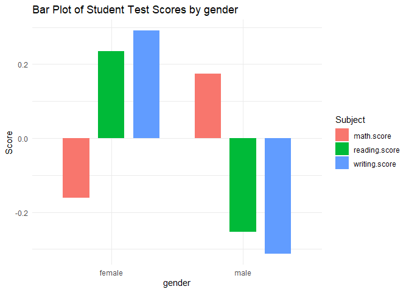

<!-- README.md is generated from README.Rmd. Please edit that file -->

# educationr2

### Written by Roxane Marine Van Olden Barneveld, Killian Harnett, Krisra Ritina and Ronan Lambe

<!-- badges: start -->
<!-- badges: end -->

educationr2 includes a data set named students consisting of the marks
secured by the students in mathematics, reading and writing exams, along
with information on gender, ethnicity, parental education level, lunch
type, and participation in a test preparation course. It allows for
analyzing the influence of these factors on academic performance. Three
functions include

1.  `prepare_student_data()` method: this prepares the data. It tidys
    into a clear readable and usable format

2.  `plot_student_scores()` method for producing nice visualizations
    based on `ggplot2`.

3.  `summary.StudentData()` this method calculations summary statistics
    for (mean median etc) for the data set

## Installation

You can install the development version of educationr2 from
[GitHub](https://github.com/) with:

``` r
# install.packages("pak")
pak::pak("roxane-vnldn/educationr2")
```

## Example

This is a basic example which shows you how to use educationr2 to
interact with the students dataset:

Firstly prepare the data

``` r
library(educationr2)

data <- prepare_student_data(students)
head(data)
#>   gender race.ethnicity parental.level.of.education        lunch
#> 1 female        group B           bachelor's degree     standard
#> 2 female        group C                some college     standard
#> 3 female        group B             master's degree     standard
#> 4   male        group A          associate's degree free/reduced
#> 5   male        group C                some college     standard
#> 6 female        group B          associate's degree     standard
#>   test.preparation.course math.score reading.score writing.score
#> 1                    none  0.3898284     0.1939016     0.3912960
#> 2               completed  0.1919795     1.4267621     1.3126119
#> 3                    none  1.5769224     1.7692233     1.6416533
#> 4                    none -1.2589131    -0.8334822    -1.5829523
#> 5                    none  0.6536271     0.6048551     0.4571043
#> 6                    none  0.3238788     0.9473163     0.6545291
```

Now to visually display the data

``` r

plot.StudentData(data, "gender", "barplot")
```

 Or we can
get statistial summarys

``` r

summary.StudentData(data, group_var = c("gender", "lunch"), summary_func = median)
#> # A tibble: 4 × 5
#>   gender lunch        math.score reading.score writing.score
#>   <fct>  <fct>             <dbl>         <dbl>         <dbl>
#> 1 female free/reduced    -0.599         -0.149      -0.00355
#> 2 female standard         0.0601         0.399       0.523  
#> 3 male   free/reduced    -0.270         -0.560      -0.596  
#> 4 male   standard         0.390         -0.114      -0.0694
```

What is special about using `README.Rmd` instead of just `README.md`?
You can include R chunks like so:

``` r
summary(cars)
#>      speed           dist       
#>  Min.   : 4.0   Min.   :  2.00  
#>  1st Qu.:12.0   1st Qu.: 26.00  
#>  Median :15.0   Median : 36.00  
#>  Mean   :15.4   Mean   : 42.98  
#>  3rd Qu.:19.0   3rd Qu.: 56.00  
#>  Max.   :25.0   Max.   :120.00
```

You’ll still need to render `README.Rmd` regularly, to keep `README.md`
up-to-date. `devtools::build_readme()` is handy for this.

You can also embed plots, for example:


In that case, don’t forget to commit and push the resulting figure
files, so they display on GitHub and CRAN.
