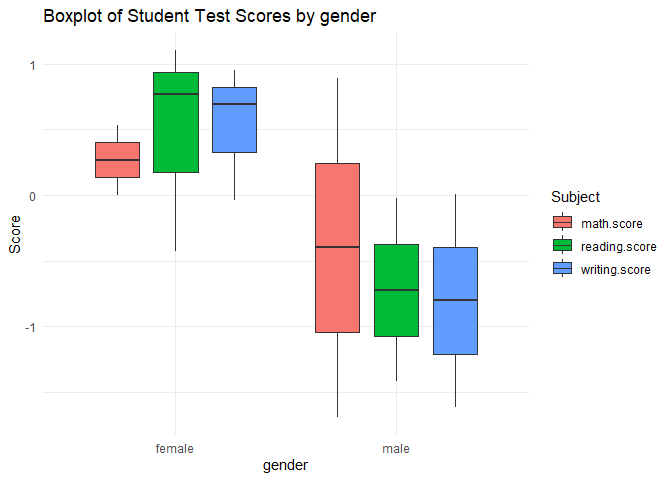

<!-- README.md is generated from README.Rmd. Please edit that file -->

# educationr2

### Written by Roxane Marine Van Olden Barneveld, Killian Harnett, Krista Ritina and Ronan Lambe

<!-- badges: start -->
<!-- badges: end -->

educationr2 includes a data set named students consisting of the marks
secured by the students in mathematics, reading and writing exams, along
with information on gender, ethnicity, parental education level, lunch
type, and participation in a test preparation course. It allows for
analyzing the influence of these factors on academic performance. Three
functions include

1.  `prepare_student_data()` method: this prepares the data. It tidys
    into a clear readable and usable format

2.  `plot.StudentData()` method for producing nice visualizations based
    on `ggplot2`.

3.  `summary.StudentData()` this method calculations summary statistics
    for (mean median etc) for the data set

## Installation

You can install the development version of educationr2 from
[GitHub](https://github.com/roxane-vnldn/educationr2/tree/main) with:

``` r
# install.packages("pak")
pak::pak("roxane-vnldn/educationr2")
```

## Example

This is a basic example which shows you how to use educationr2 to
interact with the students dataset:

Firstly prepare the data

``` r
library(educationr2)

student_data <- data.frame(
  math.score = c(72, 69, NA, 47, 76),
  reading.score = c(72, 90, 95, 57, 78),
  writing.score = c(74, 88, 93, 44, 75),
  gender = c("female", "female", "female", "male", "male")
 )
 tidy_data <- prepare_student_data(student_data, scale = TRUE, handle_missing = "mean")
 str(tidy_data)
#> Classes 'StudentData' and 'data.frame':  5 obs. of  4 variables:
#>  $ math.score   : num  0.533 0.267 0 -1.689 0.889
#>  $ reading.score: num  -0.4245 0.7694 1.1011 -1.4194 -0.0265
#>  $ writing.score: num  -0.0419 0.6922 0.9543 -1.615 0.0105
#>  $ gender       : Factor w/ 2 levels "female","male": 1 1 1 2 2
```

(Note that the scores are standardized by default, which leads to
negative score. The user can choose to standardize the data or not.)

Now to visually display the data

``` r

plot.StudentData(tidy_data, "gender", "boxplot")
```



Or we can get statistical summarys

``` r

summary.StudentData(students, group_var = c("gender", "lunch"), summary_func = median)
#> # A tibble: 4 × 5
#>   gender lunch        math.score reading.score writing.score
#>   <chr>  <chr>             <dbl>         <dbl>         <dbl>
#> 1 female free/reduced         57          67              68
#> 2 female standard             67          75              76
#> 3 male   free/reduced         62          61              59
#> 4 male   standard             72          67.5            67
```

More information is provided on the educationr2 vignette
